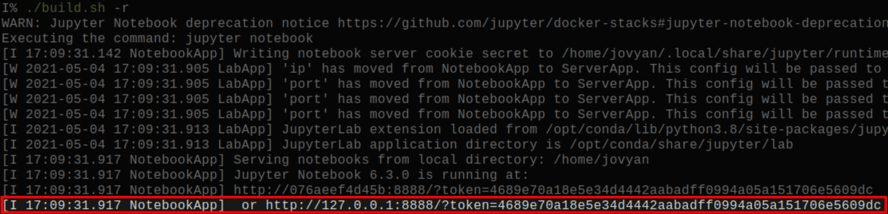
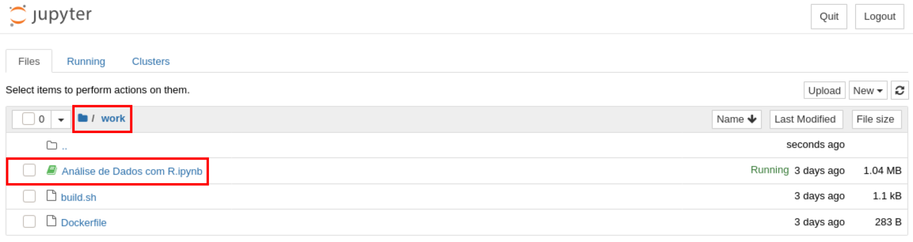

# Exercício


## Pré-Dependências

-   Distribuição Linux
-   Bash ou outro emulador de terminal
-   Conta no GitHub, Gitlab
-   Conta no Zenodo


## Dependências

-   [Git](https://git-scm.com/downloads)
-   [Docker](https://docs.docker.com/get-docker/)


## Inicialização

-   Clone o repositório do curso:

``` bash
git clone https://github.com/phrb/reprodutibilidade-eradsp-2021.git
```

-   Construa a imagem do **Docker**:

``` bash
cd reprodutibilidade-eradsp-2021/exercicio_pratico && ./build.sh -b
```

-   Inicie o servidor **Jupyter**:

``` bash
./build.sh -r
```

-   Pelo seu *browser*, acesse o servidor **Jupyter** usando o *token* gerado:



-   Na pasta *work*, abra o notebook do exercício:




## Instalando os Pacotes R

1.  Abra o notebook e rode a célula de setup
2.  Verifique a instalação rodando os exemplos do *Datasaurus*


## Análisando os Resultados


## Controle de Versão


## Arquivamento
